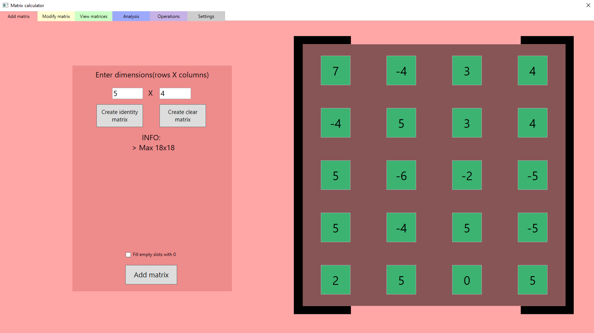
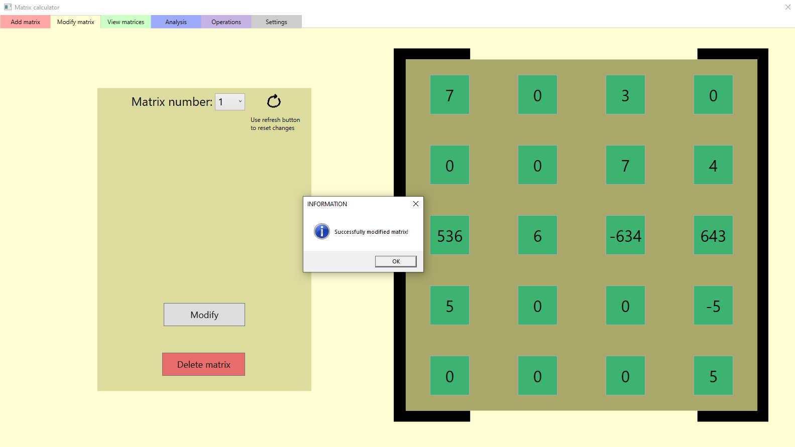
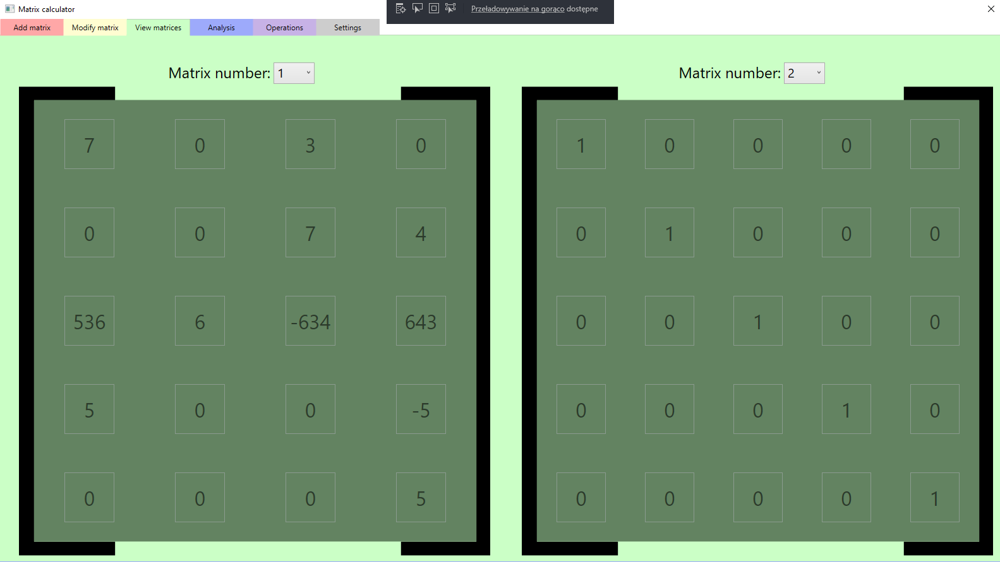
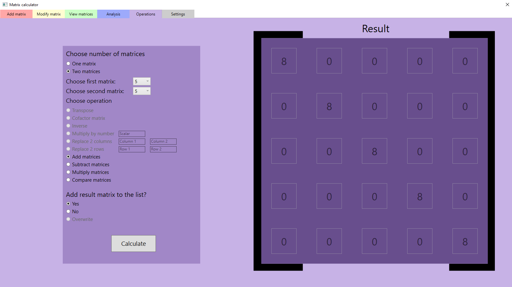

# Matrix calculator

> Very simple WPF program to operate on multiple matrices with load/save system.

## Table of contents

- [Matrix calculator](#matrix-calculator)
  - [Table of contents](#table-of-contents)
  - [General info](#general-info)
  - [Technologies](#technologies)
  - [Setup](#setup)
  - [Features](#features)
  - [Screenshots](#screenshots)
  - [Youtube video](#youtube-video)
  - [Status](#status)
  - [Why did I create it](#why-did-i-create-it)
  - [Contact](#contact)

## General info

This is a GUI program that allows to perform many operations on matrices. But also save and load them to/from .csv file. The application helps you with typos (you won't be able to create matrix with letters in it).

## Technologies

* Windows Presentation Foundation
* XAML
* .NET 3.0

## Setup

TBD

## Features

* Basic
* Create new matrices
* Editing/Deleting the existing ones
* Browse them
* Analaze matrix
* Operations on matrices:
  * Transposing
  * Inversing
  * Multiplying by number or other matrix
  * Replacing 2 rows/columns
  * Adding/Subtracting
* Save/Load your list of matrices
* Two languages: Polish and English

To upgrade:

* Better algorithm to calculate determinant
* Increase max size from 18x18 to much more.
* Better language system.
* Calculate matrices with unknowns?

## Screenshots

c

## Youtube video

[Check how it works!](https://www.youtube.com/watch?v=MHhdeUPdQII)

## Status

Project is _expansionable_.

That means it is finished and I like how it works. But I am open to any issues connected to it (such as bug fix or adding new features in the long long future).

## Why did I create it

The first version I made was just a console project to learn C#. When I knew WPF I thought about transfer this project exactly to WPF. This program may help people (students) with calculations on matrices.

## Contact

You can find contact information [here](https://jacek-jendrzejewski.azurewebsites.net/Contact).
